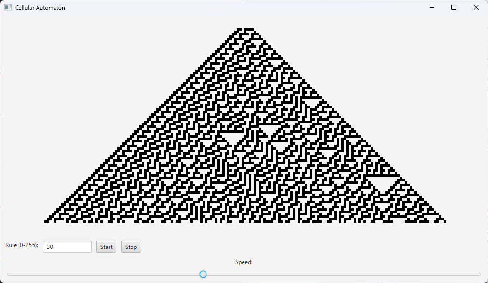

# Overview

The application simulates a one-dimensional cellular automaton with customizable rules, speed adjustment, and simulation control buttons.


## Features

- Rule Selection: Users can enter any rule number (0-255) to define the automaton’s behavior.

- Speed Adjustment: A slider allows for adjustment of the simulation speed.

- Start/Stop Control: Buttons enable users to start or stop the simulation.

- Real-Time Visualization: Displays the automaton’s evolution on a screan in real time.

# Setup and Execution
- Clone or Download:
```
git clone https://github.com/T-kazm/wolfram-cellular-automaton.git
```
- Execution:

  - **On Windows**:
  ```
  ./gradlew.bat run
  ```
  - **On Unix**:
  ```
  ./gradlew run
  ```
